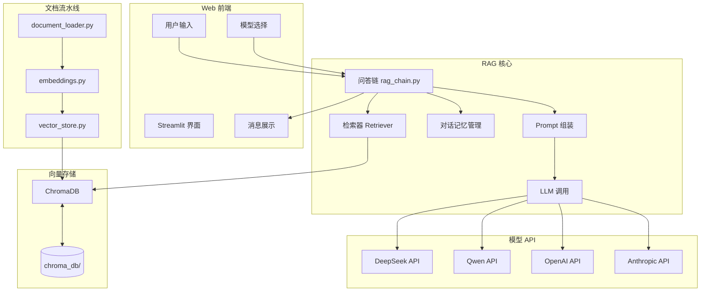
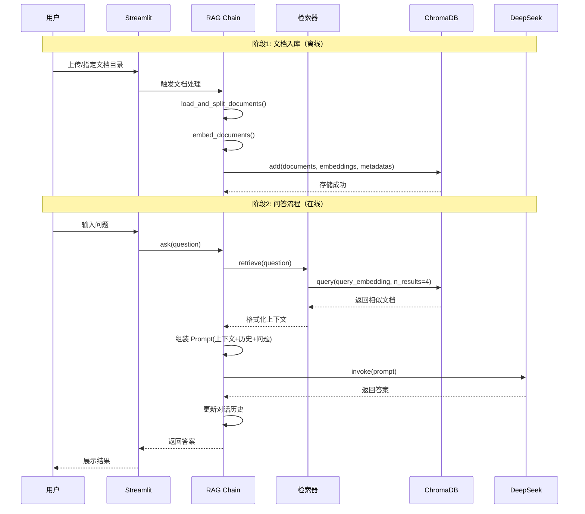
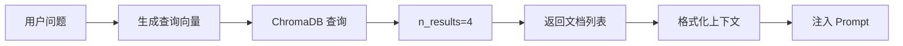

# RAG 知识库问答系统 - 项目分析报告

## 一、项目技术栈

| 组件 | 选型 | 版本要求 | 说明 |
|------|------|---------|------|
| **大模型** | DeepSeek | `langchain-deepseek>=1.0.1` | 支持多模型切换（DeepSeek、Qwen、GPT-4o、Claude） |
| **框架** | LangChain | `>=1.2.18` | RAG 核心框架，支持 LCEL |
| **向量存储** | ChromaDB | `>=1.5.9` | 轻量级嵌入式向量数据库 |
| **嵌入模型** | DeepSeek Embedding | OpenAI 兼容接口 | 通过 OpenAI SDK 调用 |
| **Web 界面** | Streamlit | `>=1.57.0` | 快速构建交互式应用 |
| **环境管理** | uv | - | Python 包管理工具 |

---

## 二、项目目录结构

```
c:\Users\th\Desktop\first cc/
├── .claude/                    # Claude 技能配置（非核心）
│   └── skills/
├── docs/                       # 知识库文档目录
│   ├── Agent(智能体、代理).md
│   ├── FastAPI笔记.md
│   ├── LainChain笔记.md
│   ├── Python笔记.md
│   ├── RAG(检索增强生成).md
│   ├── 大语言模型（LLM）.md
│   └── 提示词工程.md
├── app.py                      # [核心] Streamlit Web 界面
├── document_loader.py          # [核心] 文档加载与分割
├── embeddings.py               # [核心] 嵌入模型封装
├── main.py                     # 连接测试脚本
├── pyproject.toml              # 依赖配置
├── rag_chain.py                # [核心] RAG 问答链（含对话记忆）
├── test_embed.py               # 嵌入接口测试
├── uv.lock                     # uv 锁定文件
└── vector_store.py             # [核心] 向量数据库管理
```

**核心代码文件标记**：
- `app.py` - 前端界面入口
- `rag_chain.py` - RAG 核心逻辑（检索 + 对话记忆 + 生成）
- `vector_store.py` - 向量库构建与查询
- `embeddings.py` - 嵌入模型封装
- `document_loader.py` - 文档加载与分割

---

## 三、系统架构图



---

## 四、RAG 实现流程



---

## 五、核心组件分析

### 5.1 Embedding 模型

**实现方式**：通过 `DashScopeEmbeddings` 类封装，使用 OpenAI SDK 调用 DeepSeek Embedding API

```python
# embeddings.py:13-47
class DashScopeEmbeddings(Embeddings):
    def __init__(self, model="text-embedding-v3", api_key=None, base_url=None):
        self.client = OpenAI(
            api_key=api_key or os.environ["DEEPSEEK_API_KEY"],
            base_url=base_url or os.environ["DEEPSEEK_API_BASE"],
        )
```

**设计考量**：
- 绕过 `langchain_openai.OpenAIEmbeddings` 的兼容性问题
- 支持批量处理（batch_size=10）
- 支持多模型切换（v3/v4）

---

### 5.2 向量数据库

**选型**：ChromaDB（轻量级、无需独立服务）

**核心操作**：
| 操作 | 函数 | 文件位置 |
|------|------|---------|
| 创建集合 | `client.get_or_create_collection()` | vector_store.py:56 |
| 添加文档 | `collection.add()` | vector_store.py:78 |
| 查询相似 | `collection.query()` | rag_chain.py:163 |

**存储结构**：
```
chroma_db/
├── chroma.sqlite3          # 元数据存储
└── chroma_collections/     # 向量数据目录
```

---

### 5.3 大模型调用方式

支持四种模型切换：

| 模型类型 | 包依赖 | 环境变量 |
|---------|--------|---------|
| DeepSeek | `langchain-deepseek` | `DEEPSEEK_API_KEY`, `DEEPSEEK_API_BASE` |
| Qwen | `langchain-community` | `QWEN_API_KEY` |
| GPT-4o | `langchain-openai` | `OPENAI_API_KEY`, `OPENAI_API_BASE` |
| Claude | `langchain-anthropic` | `ANTHROPIC_API_KEY` |

**调用入口**：`rag_chain.py:get_llm()`

---

### 5.4 文件上传流程

**当前实现**：通过目录扫描方式加载文档，**无 Web 端文件上传功能**

```python
# document_loader.py:8-72
def load_and_split_documents(directory_path: str):
    # 支持: .pdf, .md, .txt
    pdf_files = list(doc_dir.glob("*.pdf"))
    md_files = list(doc_dir.glob("*.md"))
    txt_files = list(doc_dir.glob("*.txt"))
```

**文档分割策略**：
- `chunk_size=500`
- `chunk_overlap=50`
- 支持中英文分隔符

---

### 5.5 检索流程



**检索参数**：
- `top_k=4`：每次检索返回 4 个最相关文档
- 距离阈值：未设置（默认返回所有匹配）

---

### 5.6 Prompt 工程实现

**系统提示词设计**（`rag_chain.py:26-36`）：

```python
SYSTEM_PROMPT = """你是一个知识库问答助手。请根据以下提供的上下文和对话历史来回答问题。

规则：
1. 优先根据上下文回答，不要编造不存在的信息。
2. 如果上下文中没有足够的信息，请直接说"根据提供的资料，我无法找到答案"。
3. 如果用户问的是关于之前对话的问题（如"刚才说到哪了"），请结合对话历史回答。
4. 回答要准确、简洁，使用中文。

上下文：
{context}
"""
```

**Prompt 结构**：
```
系统提示词（含上下文）
├── 对话历史（可选）
└── 用户问题
```

---

## 六、存在的问题

### 6.1 Bug 风险

| 编号 | 问题描述 | 位置 | 严重程度 |
|------|---------|------|---------|
| **BUG-001** | `embeddings.py` 类名 `DashScopeEmbeddings` 与实际调用 DeepSeek API 不符，造成混淆 | embeddings.py:13 | **高** |
| **BUG-002** | `get_embeddings()` 函数在 `vector_store.py` 和 `embeddings.py` 中重复定义 | vector_store.py:10-30, embeddings.py:49-55 | **中** |
| **BUG-003** | `app.py` 中 `file_stack` 状态管理未实际用于文档上传，仅展示数量 | app.py:164-165, 227-233 | **中** |
| **BUG-004** | `rag_chain.py:get_llm()` 未导入 `Any` 类型注解 | rag_chain.py:82 | **低** |
| **BUG-005** | API Key 未设置时会抛出 `KeyError`，而非优雅提示 | 多处 | **高** |

### 6.2 冗余代码

| 文件 | 冗余内容 | 说明 |
|------|---------|------|
| `vector_store.py` | `get_embeddings()` 重复实现 | 应直接导入 `embeddings.py` 中的实现 |
| `main.py` | 独立的模型测试脚本 | 可整合到单元测试 |
| `test_embed.py` | 临时测试文件 | 建议删除或归档 |

### 6.3 功能缺失

1. **Web 端文件上传** - 用户无法通过界面上传文档
2. **文档管理** - 无法删除/更新已入库的文档
3. **错误处理** - API 调用失败时缺少重试机制
4. **日志记录** - 缺少操作日志和错误日志
5. **会话管理** - 仅支持单会话，无多用户隔离

---

## 七、代码优化建议

### 7.1 修复 Bug-001：类名与实际用途不一致

**问题**：`DashScopeEmbeddings` 类名暗示使用阿里云百炼，但实际调用的是 DeepSeek API

**优化方案**：
```python
# embeddings.py
class DeepSeekEmbeddings(Embeddings):
    """通过 OpenAI 兼容接口调用 DeepSeek 嵌入模型。"""
    def __init__(self, model="text-embedding-v3", api_key=None, base_url=None):
        self.model = model
        self.client = OpenAI(
            api_key=api_key or os.environ["DEEPSEEK_API_KEY"],
            base_url=base_url or os.environ["DEEPSEEK_API_BASE"],
        )
```

### 7.2 消除冗余代码

**问题**：`get_embeddings()` 在两个文件中重复定义

**优化方案**：删除 `vector_store.py` 中的 `get_embeddings()`，改为从 `embeddings.py` 导入

```python
# vector_store.py
from embeddings import get_embeddings
```

### 7.3 增加错误处理

**问题**：缺少 API Key 验证和异常处理

**优化方案**：
```python
# rag_chain.py
def get_llm(model_type: str = "deepseek") -> Any:
    required_vars = {
        "deepseek": ["DEEPSEEK_API_KEY"],
        "qwen": ["QWEN_API_KEY"],
        "openai": ["OPENAI_API_KEY"],
        "anthropic": ["ANTHROPIC_API_KEY"],
    }
    
    for var in required_vars.get(model_type, []):
        if var not in os.environ:
            raise ValueError(f"环境变量 {var} 未设置")
    
    # ... 后续代码
```

---

## 八、升级路线图

### 短期目标（1-2 周）

| 任务 | 优先级 | 描述 |
|------|-------|------|
| 修复类名混淆问题 | **P0** | 将 `DashScopeEmbeddings` 重命名为 `DeepSeekEmbeddings` |
| 消除代码冗余 | **P1** | 统一 `get_embeddings()` 实现 |
| 增加 API Key 验证 | **P1** | 启动时检查必要环境变量 |

### 中期目标（1-2 月）

| 任务 | 优先级 | 描述 |
|------|-------|------|
| 添加文件上传功能 | **P0** | 支持 Web 端上传 PDF/TXT/MD 文件 |
| 实现文档管理 API | **P1** | 支持删除、更新已入库文档 |
| 添加日志系统 | **P2** | 记录操作日志和错误日志 |
| 增加重试机制 | **P2** | API 调用失败时自动重试 |

### 长期目标（3-6 月）

| 任务 | 优先级 | 描述 |
|------|-------|------|
| 支持多向量数据库 | **P2** | 增加 Milvus/Pinecone 支持 |
| 实现 RAG 优化技术 | **P3** | 如 Reranking、Hybrid Search |
| 添加权限管理 | **P3** | 支持多用户访问控制 |
| 部署优化 | **P2** | 支持 Docker/K8s 部署 |

---

## 九、总结

### 项目亮点

1. **技术栈成熟**：采用 LangChain + ChromaDB + Streamlit 的主流 RAG 技术栈
2. **多模型支持**：灵活支持 DeepSeek、Qwen、GPT-4o、Claude 四种大模型
3. **对话记忆**：基于 `InMemoryChatMessageHistory` 实现多轮对话
4. **代码结构清晰**：按功能模块划分文件，便于维护

### 改进方向

1. **修复命名混淆**：统一嵌入模型命名
2. **消除冗余**：合并重复代码
3. **增强用户体验**：添加文件上传功能
4. **提高健壮性**：完善错误处理和日志记录

---

*分析完成时间：2026-06-06*