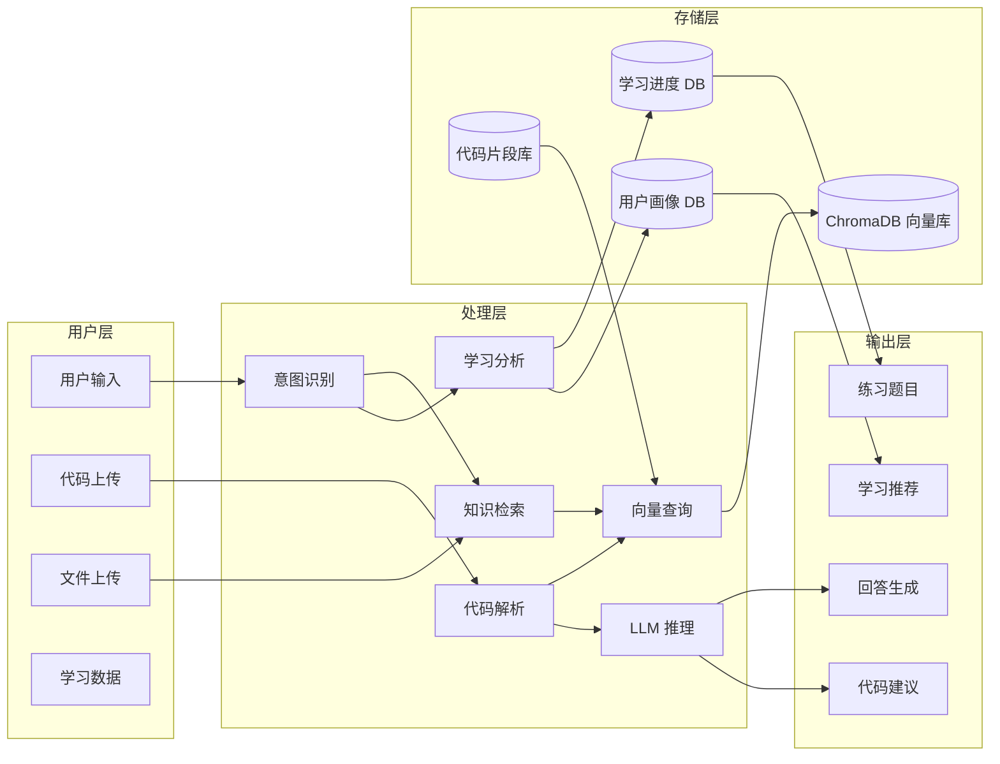
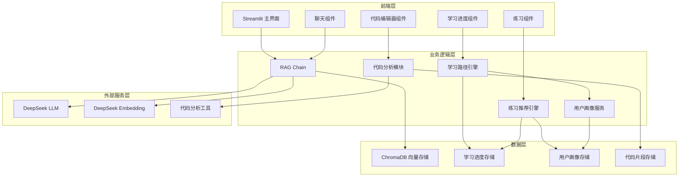

# AI Developer Copilot - 升级方案

## 一、项目概述

将现有 RAG 知识库问答系统升级为 **AI Developer Copilot（AI开发学习助手）**，面向程序员学习和开发场景，提供代码理解、问题解答、学习路径规划等智能化服务。

---

## 二、功能架构图

```mermaid
graph TB
    subgraph 核心功能模块
        A[代码助手]
        B[知识库问答]
        C[学习路径规划]
        D[编程练习]
        E[面试准备]
        F[工具集成]
    end
    
    subgraph 代码助手子功能
        A1[代码解释]
        A2[代码审查]
        A3[代码优化建议]
        A4[Bug 定位]
        A5[代码生成]
    end
    
    subgraph 知识库问答子功能
        B1[技术文档查询]
        B2[API 文档检索]
        B3[概念解释]
        B4[最佳实践]
    end
    
    subgraph 学习路径子功能
        C1[能力测评]
        C2[个性化推荐]
        C3[进度追踪]
        C4[学习计划]
    end
    
    subgraph 编程练习子功能
        D1[算法题推荐]
        D2[代码调试]
        D3[代码挑战]
        D4[代码对比]
    end
    
    subgraph 面试准备子功能
        E1[面试题库]
        E2[模拟面试]
        E3[简历优化]
        E4[职业规划]
    end
    
    subgraph 工具集成子功能
        F1[Git 助手]
        F2[CI/CD 助手]
        F3[Docker 助手]
        F4[K8s 助手]
    end
    
    A --> A1
    A --> A2
    A --> A3
    A --> A4
    A --> A5
    
    B --> B1
    B --> B2
    B --> B3
    B --> B4
    
    C --> C1
    C --> C2
    C --> C3
    C --> C4
    
    D --> D1
    D --> D2
    D --> D3
    D --> D4
    
    E --> E1
    E --> E2
    E --> E3
    E --> E4
    
    F --> F1
    F --> F2
    F --> F3
    F --> F4
```



---

## 三、数据流图



---

## 四、页面设计图

```mermaid
flowchart TD
    subgraph 主界面布局
        A[顶部导航栏]
        B[左侧功能菜单]
        C[中间主内容区]
        D[右侧辅助面板]
    end
    
    subgraph 顶部导航栏
        A1[Logo]
        A2[搜索框]
        A3[用户头像]
        A4[设置按钮]
    end
    
    subgraph 左侧功能菜单
        B1[代码助手]
        B2[知识库]
        B3[学习路径]
        B4[编程练习]
        B5[面试准备]
        B6[工具集成]
    end
    
    subgraph 中间主内容区
        C1[聊天消息区]
        C2[代码编辑器]
        C3[学习进度展示]
        C4[练习题目展示]
    end
    
    subgraph 右侧辅助面板
        D1[学习状态]
        D2[推荐内容]
        D3[快捷键提示]
        D4[最近活动]
    end
    
    A --> A1
    A --> A2
    A --> A3
    A --> A4
    
    B --> B1
    B --> B2
    B --> B3
    B --> B4
    B --> B5
    B --> B6
    
    C --> C1
    C --> C2
    C --> C3
    C --> C4
    
    D --> D1
    D --> D2
    D --> D3
    D --> D4
```



---

## 五、技术架构图



---

## 六、开发优先级

### P0 - 核心功能（MVP）

| 优先级 | 功能模块 | 描述 | 复用现有代码 |
|-------|---------|------|-------------|
| P0.1 | 代码助手 | 代码解释、代码审查、代码生成 | 修改 rag_chain.py |
| P0.2 | 知识库问答 | 技术文档查询、概念解释 | 复用现有 RAG |
| P0.3 | 学习路径规划 | 能力测评、个性化推荐 | 新增模块 |
| P0.4 | 用户画像 | 存储用户学习数据 | 新增模块 |

### P1 - 扩展功能

| 优先级 | 功能模块 | 描述 | 复用现有代码 |
|-------|---------|------|-------------|
| P1.1 | 编程练习 | 算法题推荐、代码调试 | 新增模块 |
| P1.2 | 面试准备 | 面试题库、模拟面试 | 新增模块 |
| P1.3 | 工具集成 | Git、Docker、K8s 助手 | 新增模块 |

### P2 - 优化功能

| 优先级 | 功能模块 | 描述 | 复用现有代码 |
|-------|---------|------|-------------|
| P2.1 | 代码对比 | 不同实现方式对比 | 新增模块 |
| P2.2 | 简历优化 | AI 简历审查 | 新增模块 |
| P2.3 | 职业规划 | 发展路径建议 | 新增模块 |

---

## 七、MVP 版本

### 7.1 功能范围

**核心功能：**
1. **代码助手**
   - 代码解释：输入代码片段，AI 解释其功能和实现原理
   - 代码审查：检查代码中的潜在问题和改进建议
   - 代码生成：根据需求描述生成代码

2. **知识库问答**
   - 技术文档查询：检索技术文档回答问题
   - 概念解释：解释编程概念和术语
   - 最佳实践：提供编程最佳实践建议

3. **学习路径规划**
   - 能力测评：评估用户当前技术水平
   - 个性化推荐：根据测评结果推荐学习内容
   - 进度追踪：记录学习进度

### 7.2 技术实现

**前端（Streamlit）：**
- 主界面：左侧功能菜单 + 中间聊天区 + 右侧状态面板
- 代码编辑器：支持代码输入和高亮显示
- 学习进度展示：可视化学习数据

**后端（LangChain）：**
- RAG Chain：复用现有代码，扩展 Prompt 模板
- 代码分析：新增代码解析和处理逻辑
- 用户画像：简单的内存存储（后续可持久化）

**数据存储：**
- ChromaDB：存储技术文档向量
- JSON 文件：存储用户学习数据（MVP 阶段）

### 7.3 代码复用计划

| 现有文件 | 复用方式 | 修改内容 |
|---------|---------|---------|
| `app.py` | 完全复用 | 扩展页面布局和组件 |
| `rag_chain.py` | 核心复用 | 新增代码分析相关 Prompt |
| `embeddings.py` | 完全复用 | 无修改 |
| `vector_store.py` | 完全复用 | 无修改 |
| `document_loader.py` | 完全复用 | 无修改 |

### 7.4 新增模块

| 新增文件 | 功能描述 |
|---------|---------|
| `code_analyzer.py` | 代码解析和分析逻辑 |
| `learning_engine.py` | 学习路径规划和推荐 |
| `user_profile.py` | 用户画像管理 |
| `prompts/code_prompts.py` | 代码相关的 Prompt 模板 |

---

## 八、简历项目亮点

### 8.1 项目价值

- **面向开发者**：专注于程序员学习和开发场景的智能助手
- **代码理解能力**：能够解析、解释和优化代码
- **个性化学习**：基于用户画像提供定制化学习路径
- **多模态交互**：支持文本、代码、文件等多种输入方式

### 8.2 技术亮点

1. **RAG 增强代码理解**
   - 将代码片段与技术文档结合，提供深度解答
   - 支持代码上下文检索

2. **智能学习推荐**
   - 基于用户能力测评的个性化推荐
   - 学习进度追踪和反馈

3. **多模型支持**
   - 兼容 DeepSeek、Qwen、GPT-4o、Claude 等多种大模型
   - 灵活切换满足不同需求

4. **快速开发**
   - 使用 Streamlit 快速构建交互界面
   - 模块化设计便于扩展

### 8.3 功能亮点

1. **代码助手**：代码解释、审查、生成一站式服务
2. **知识库问答**：技术文档智能检索和问答
3. **学习路径规划**：个性化学习计划和进度追踪
4. **编程练习**：算法题推荐和代码调试

---

## 九、实施路线图

### 第一阶段（1-2 周）：MVP 核心功能

1. 扩展 `rag_chain.py`，添加代码分析相关的 Prompt 模板
2. 创建 `code_analyzer.py`，实现代码解析功能
3. 创建 `user_profile.py`，实现用户画像管理
4. 更新 `app.py`，添加代码编辑器组件

### 第二阶段（2-3 周）：学习路径模块

1. 创建 `learning_engine.py`，实现学习路径规划
2. 添加能力测评功能
3. 实现个性化推荐算法
4. 添加学习进度展示组件

### 第三阶段（2-3 周）：扩展功能

1. 添加编程练习模块
2. 添加面试准备模块
3. 添加工具集成模块

### 第四阶段（1-2 周）：优化和部署

1. 性能优化
2. 错误处理和日志记录
3. Docker 容器化部署
4. 文档完善

---

## 十、代码扩展示例

### 10.1 新增 code_analyzer.py

```python
"""代码分析模块：代码解析、解释、审查和生成"""

from langchain_deepseek import ChatDeepSeek
from langchain_core.prompts import ChatPromptTemplate

def analyze_code(code: str, task: str = "explain") -> str:
    """
    分析代码
    
    Args:
        code: 代码片段
        task: 任务类型（explain/review/optimize/generate）
    
    Returns:
        分析结果
    """
    prompts = {
        "explain": """请详细解释以下代码的功能和实现原理：\n\n{code}""",
        "review": """请审查以下代码，指出潜在问题和改进建议：\n\n{code}""",
        "optimize": """请优化以下代码，并说明优化理由：\n\n{code}""",
        "generate": """请根据以下需求生成代码：\n\n{code}"""
    }
    
    prompt = ChatPromptTemplate.from_messages([
        ("system", "你是一个资深软件工程师，请提供专业的代码分析。"),
        ("human", prompts.get(task, prompts["explain"]))
    ])
    
    llm = ChatDeepSeek(model="deepseek-v3")
    chain = prompt | llm
    
    return chain.invoke({"code": code}).content
```

### 10.2 新增 user_profile.py

```python
"""用户画像模块：管理用户学习数据和偏好"""

from dataclasses import dataclass
from typing import Dict, List

@dataclass
class UserProfile:
    user_id: str
    name: str
    skills: Dict[str, int]  # 技能水平 { "python": 80, "javascript": 60 }
    interests: List[str]
    learning_goals: List[str]
    progress: Dict[str, float]  # 学习进度

class ProfileManager:
    def __init__(self):
        self._profiles: Dict[str, UserProfile] = {}
    
    def get_profile(self, user_id: str) -> UserProfile:
        return self._profiles.get(user_id)
    
    def update_profile(self, user_id: str, **kwargs):
        if user_id not in self._profiles:
            self._profiles[user_id] = UserProfile(user_id=user_id, **kwargs)
        else:
            profile = self._profiles[user_id]
            for key, value in kwargs.items():
                setattr(profile, key, value)
```

---

*升级方案完成时间：2026-06-06*